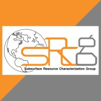
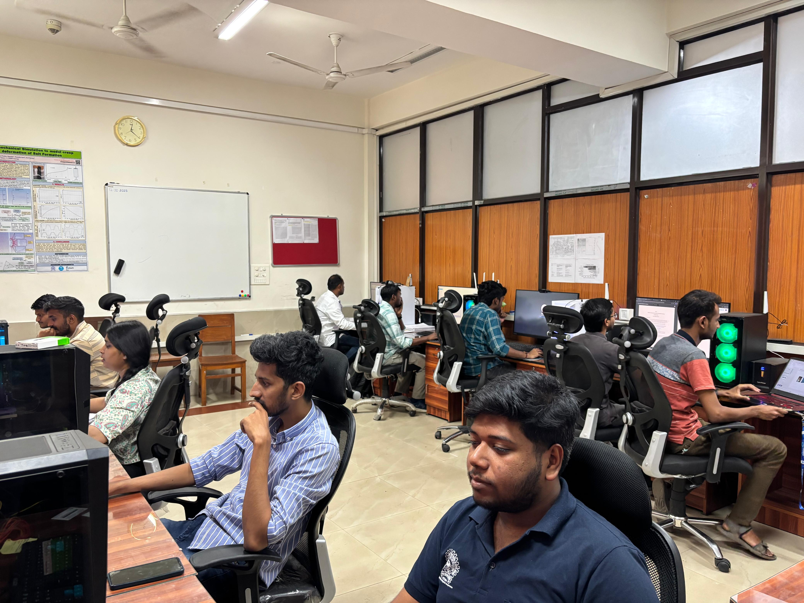
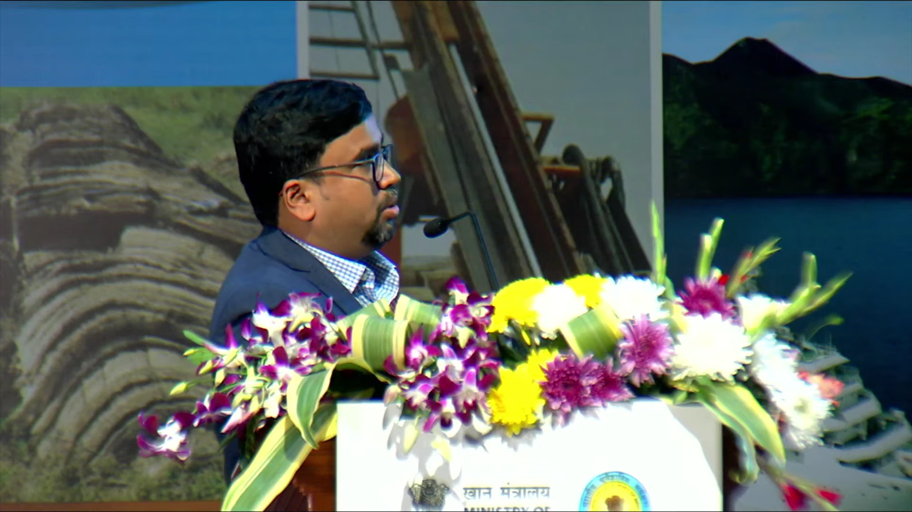
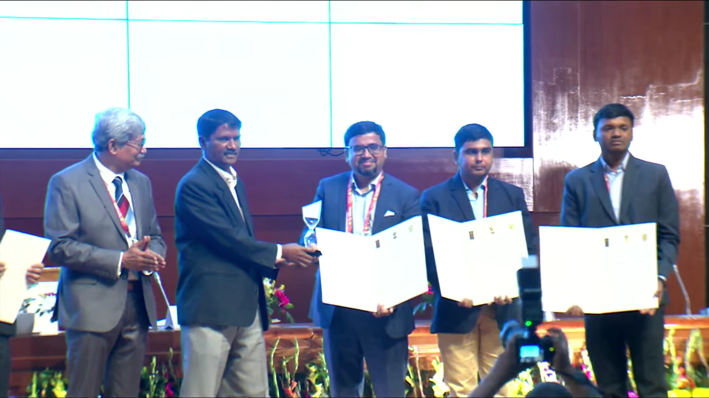
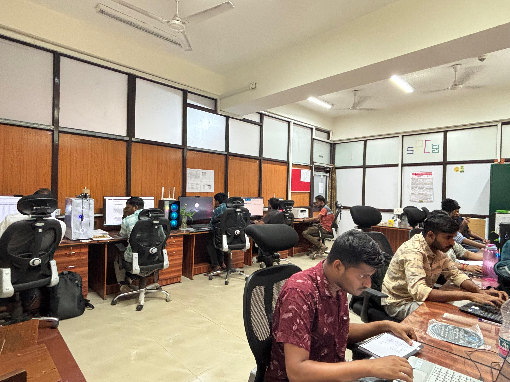

# Subsurface Resource Characterization Group (sRCg) – IIT(ISM) Dhanbad

Welcome to the official GitHub organization of the **Subsurface Resource Characterization Group (sRCg)**, part of the **Department of Applied Geophysics** at **IIT(ISM) Dhanbad**.

We are a research group dedicated to solving geophysical challenges related to **subsurface resource characterization**, through a blend of innovation, data science, and collaboration.

---

## 🧭 About Us

Founded in **2023**, sRCg is committed to solving complex geophysical challenges related to **subsurface resource characterization**. We aim to bridge the gap between academic research and industrial application through data-driven innovation and interdisciplinary collaboration.

Our research focuses on:

- ⛽ **Petrophysics**  
- 🪨 **Geomechanics**  
- 🪨 **Rock Physics**  
- 🌍 **Seismic Studies**

---

## 👨‍🏫 Leadership

The group is led by [**Dr. Partha Pratim Mandal**](https://www.linkedin.com/in/ppmcurtin), whose research interests span across rock physics, seismic inversion, and geomechanical modeling. Under his guidance, the team consists of:

- Post-doctoral Researchers  
- Ph.D. Scholars  
- Master's Students  

---

## 📚 Current Projects

Coming soon: A detailed list of our ongoing projects in collaboration with industry and academic partners.

---

## 🏆 Achievements

- 🥉 Achieved **Third Place** in the prestigious **Hackathon 2024**, organized by the **Geological Survey of India (GSI)**.  
  Themed **"Innovative Mineral Hunt Techniques for Mineral Prospectivity Mapping"**, the hackathon aimed to inspire forward-thinking solutions for mineral exploration.  
  Our project was lauded for its integration of:
  - Advanced geophysical data interpretation  
  - Multi-dataset integration strategies  
  - AI/ML-driven analytical approaches

- 🎓 Presented at the **III Industry-Institute Interaction and R&D Fair 2024**, held during *Srijan*, the annual fest of IIT(ISM) Dhanbad.  
  The event provided a platform to showcase our research innovations and foster academic-industry collaboration.

- 🤝 Engaged in collaborative initiatives with industry leaders such as **Coal India Limited**, strengthening the bridge between applied research and industrial implementation.

> _Stay tuned as we continue to expand our impact through new achievements, research breakthroughs, and national/international recognitions._

---

## 📬 Contact Us

For research collaborations, internships, or inquiries:

📧 **srcg.iitism@gmail.com**

🔗 [LinkedIn – sRCg IIT(ISM)](https://in.linkedin.com/company/srcgiitism)

---

Thank you for visiting our page.  
*— Team sRCg*
